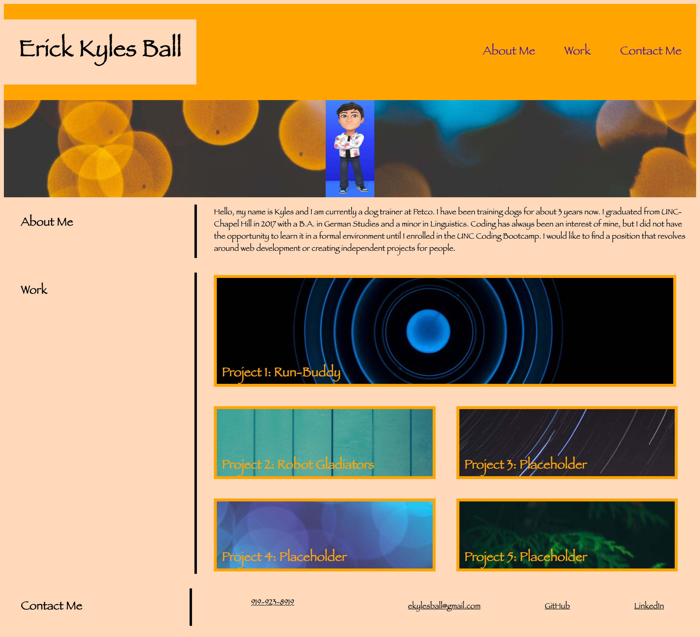

# Challenge #2 - Main Portfolio

## Description

    This project was about creating a personal portfolio that showcases our projects to future employers or potential clientele. It contains a responsive header with navigation links, a hero section with an avatar, a short About-Me section, a Works section where the projects are stored in button-like links (3 are placeholders), and a Contact-Me section with phone number, email, Github, and LinkedIn links. 

## Experience Gained

    By building this portfolio from scratch, I felt as though I gained a better understanding of using html and css together. The most challenging task was aligning the section headers to the section content so it moved rather seamlessly. It required quite a bit of using flexbox properties alongside media queries.
    Overall, I am quite satisfied with how it turned out in the end and am looking forward to filling out the works section with more projects.

## GitHub Links (Deployed Site and Repository)

    The project deployment can be seen at: https://ekball.github.io/C2-Portfolio/

    The repository link: https://github.com/ekball/C2-Portfolio

## Deployed Site Screenshot

